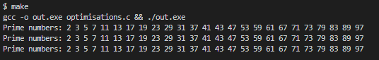

# Week 8 - Optimisations Exercise

This repository contains the Week 8 assignment source code.

## Assignment

Choose a small algorithm to implement in different ways. Describe when/why you might use each. You can choose any small algorithm.

## Results

The algorithm chosen is "find the first 100 prime numbers". The source code `optimisations.c` in this repo 
implements 3 versions which either:

1. Use less RAM and code space but trades this for processor cycles. 
2. Trade processor cycles for less RAM and code space.

I would use the first algorithm if memory is at a premium, and the other two if speed is more important. Algorithm 2 strikes a balance between the two.

The outputs of all three functions:

In godbolt.org, they appear like so ([link](https://godbolt.org/z/9sn4KqfGx)):

Algorithm 1:
31 assembly instructions

Algorithm 2:
20 assembly instructions

Algorithm 3:
9 assembly instructions
